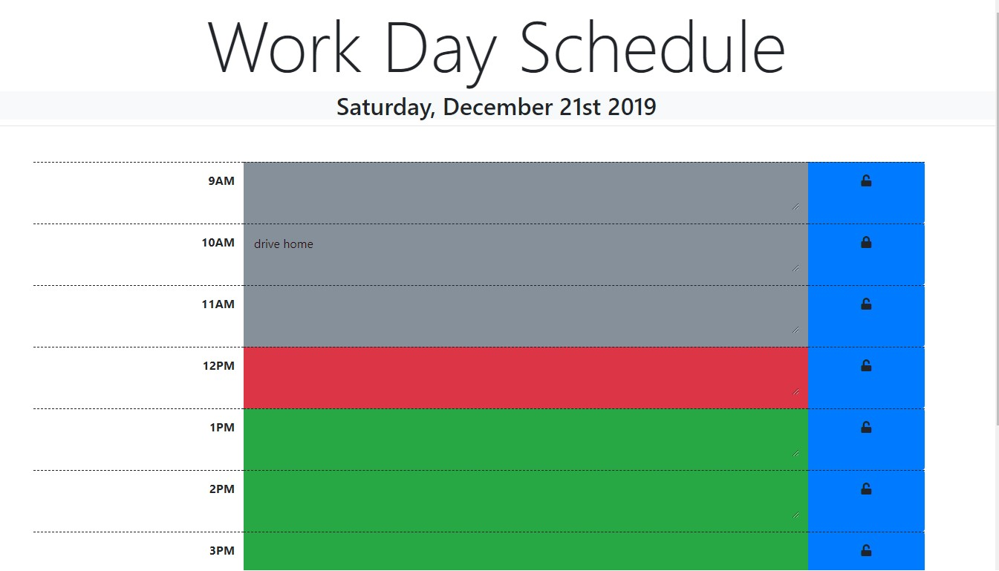

# Daily Schedule

 

## What it is

This is a schedule for your typical 9-5 workday.

## Where it is

 The live deployment of this daily schedule is located here <https://juliet2319.github.io/day-planner/>

## How to use it

 In any time block, enter the tasks that you have scheduled. Click the lock in that time block to lock that time slot and save it to your local storage.

 To remove an item, click the lock again to enable editing and remove it from local storage.

 As the day progresses, the schedule will indicate the current hour by changing the background of the tasks to red. Past hours will become gray and future hours will be green.
